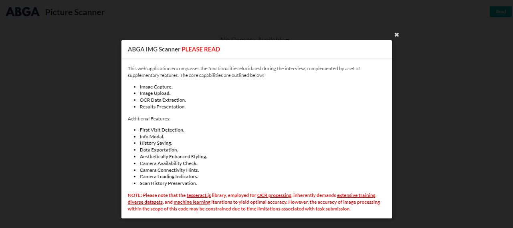
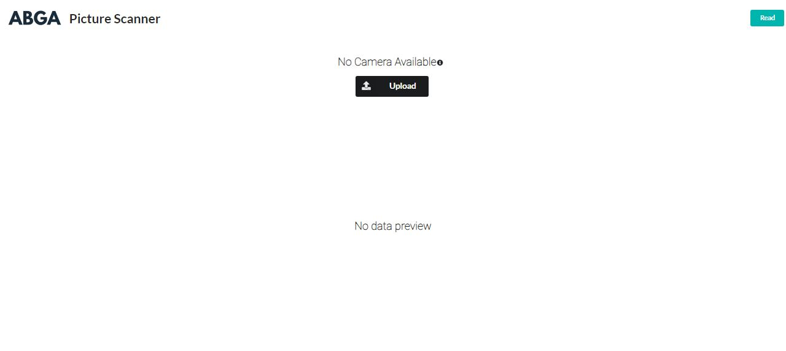
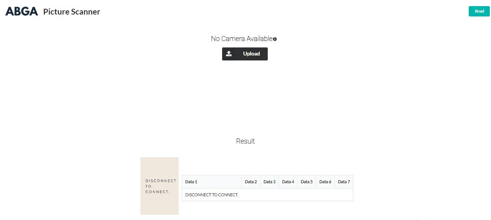
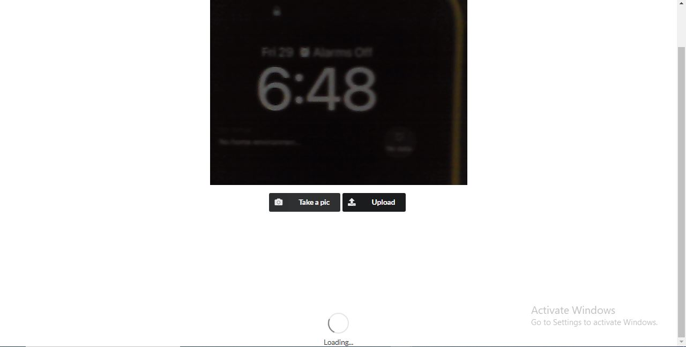
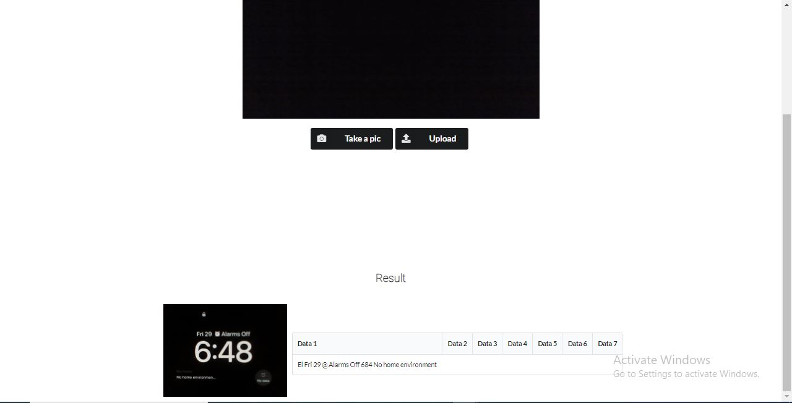

# Img Scanner Web App Using Reactjs, Nodejs(Express) & Tesseractjs

An Image Scanner Application Web App Using Mainly Reactjs, Nodejs(Express) & Tesseractjs. The Supported packages in this Web App are "React", "React Webcam" & Semantic UI. This can recognize text/chars from captured photo or uploaded image.

#
- To try:

    1. __Clone this repo__

        ```bash
        $ git clone https://github.com/YazanNajem/ABGA-IMG-Scanner.git
        ```

    2. __Setup Node.js server__

        Install packages & run the server
        ```bash
        $ cd ABGA Assignment Scanner
        $ cd server-scanner
        $ npm i
        $ nodemon server
        ```
        NOTE: Install nodemon.
        It will run @ `localhost:5000`.

    3. __Setup React app__

        Install packages & run the app:
        ```bash
        $ cd ABGA Assignment Scanner
        $ cd web-cam-scanner
        $ npm i
        $ npm start
        ```
        It will run @ `localhost:3000`.
#

- __Preview__

  Home Page Message

  

  Home Page
  
  

  Upload picture Result
  
  

  Capture a picture loading
  
   11-web-cap-result.JPG

  Capture a picture Result
  
  

<hr>

#### 🍔 Yazan Najem

<br>

<a href="mailto: yazanbassamnajem@gmail.com">
  
</a>

<a href="https://www.linkedin.com/in/seit-yazannajem/">
  
</a>